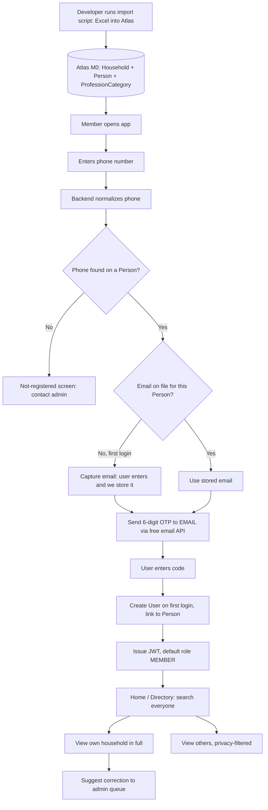
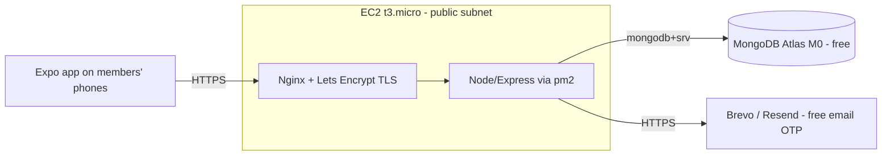

# Samaj Connect — Build Spec

A directory + events app for the **"Vadodara-sthit 28 Gaam Vardhari–Virpur Leuva
Patidar"** community (~400–500 people, ~150 households). The full member roster already
exists in an Excel workbook. The developer loads it into the database with a one-time
script; **a member just logs in and immediately gets access to search the directory.**
There is no "build your profile from scratch" step.

This document is the single source of truth. Build the backend + import script first,
then the mobile app.

---

## Tech stack (everything must stay on a free tier)

- **Mobile app:** React Native + Expo, TypeScript
- **Backend:** Node.js + Express, TypeScript
- **Database:** MongoDB — **MongoDB Atlas M0 free tier** (512 MB, free forever)
- **ORM:** Prisma (`provider = "mongodb"`)
- **Auth:** Phone identifies the member; **OTP is sent by EMAIL** (free). JWT sessions.
- **State:** React Query (server state) + Zustand (UI/session)
- **Validation:** Zod on every request body/query
- **Hosting:** single **AWS EC2 t3.micro** (free-tier) behind Nginx + Let's Encrypt
- **Email:** free transactional provider (Brevo or Resend) via Nodemailer/SDK

> **🟢 FREE-TIER RULE:** Do not introduce paid services — no managed Postgres/RDS, no SMS
> gateway, no paid email plan, no load balancer (ALB/NLB), no NAT gateway, no managed
> Redis. If something seems to need one, flag it instead of adding it. The whole stack
> is: **EC2 t3.micro + Atlas M0 + free email API + Nginx on the same box.**

---

## 1. The source data — read before writing the importer

The Excel workbook is **not** flat. It is a **hierarchical, merged-cell block layout**:
one block of rows per household. Household-level fields appear once on the block's first
row; person-level fields repeat on every row of the block.

### 1.1 Workbook shape
- **23 sheets**, one per native village. **The sheet name IS the native place.**
- ~**153 households**, ~**402 total people** (including family members).
- **~96% of households have a phone number** → phone is a reliable login key.
- Branding says "28 villages" but only 23 tabs carry data — confirm whether 5 are
  missing/merged.

### 1.2 Column layout (Gujarati header → meaning → level)

| Col | Gujarati header | Meaning | Level |
|----|------------------|---------|-------|
| A | અ.નં. | Serial no. | block marker |
| B | મુખ્ય સભ્ય નું નામ | Main member (head) name | **Household** |
| C | મોબાઈલ નંબર | Household mobile (primary login) | **Household** |
| D | વતનનું સરનામું | Native address (just repeats village) | Household |
| E | વડોદરા નું સરનામું | Vadodara address | **Household** |
| F | પરિવારના સભ્યો ના નામ | Family member name | **Person** |
| G | સબંધ | Relation | **Person** |
| H | જન્મ તારીખ | Date of birth | Person |
| I | વ્યવસાય/અભ્યાસ | Profession / study | **Person** |
| J | મોબાઈલ નંબર | That person's own mobile | Person |
| K | બ્લડ ગ્રુપ | Blood group | Person |

### 1.3 Real example block (sheet "ખેરોલી")
```
1 | હિરલકુમાર રમેશભાઈ પટેલ | 9428656090 | ખેરોલી | A35 હેપ્પી હોમ બંગ્લોઝ... | હિરલકુમાર રમેશભાઈ પટેલ | પોતે   | 19/10/1984 | મુખ્ય શિક્ષક   | 9428656090 | B+
  |                        |            |        |                          | મનીષાબેન હિરલકુમાર પટેલ | પત્ની  | 28/11/1982 | શિક્ષક         | 9409011623 | O+
  |                        |            |        |                          | પવિત્રા હિરલકુમાર પટેલ  | પુત્રી | 18/08/2007 | B.sc rediology |            | O+
  |                        |            |        |                          | શૌર્ય હિરલકુમાર પટેલ    | પુત્ર  | 20/06/2011 | 10th           |            | O+
<blank row = end of block>
```

### 1.4 Parsing rules the import script MUST follow
1. **Iterate per sheet**; the sheet name → `Household.nativePlace`.
2. Find the header row (col A == `અ.નં.`); data starts below it.
3. A row with a **number in col A AND a name in col B** starts a **new household**;
   capture household fields B, C, D, E from that row.
4. Every row with a **name in col F** is a **Person** in the current household.
   - The person whose relation is self (`પોતે`) is the **head**; set
     `Household.headPersonId` to them.
5. A fully blank row ends the current block.
6. **Ignore numbered-but-empty rows** (template placeholders: serial present, no name).

### 1.5 Data is messy & bilingual — build a normalization layer
Real values observed; the importer must clean these or search/filters break.

- **Phone numbers** come as floats (`9428656090.0`) and mixed formats (`+91 …`, `91-…`,
  spaces). Normalize to a canonical 10-digit string (also store E.164 `+91XXXXXXXXXX`).
  **Dedup on canonical phone.**
- **Relations** are mixed Gujarati/English with typos. Map to an enum:
  `પોતે→SELF, પત્ની/Wife→SPOUSE, પુત્ર/Son/"put"→SON, પુત્રી/Daughter→DAUGHTER,`
  `પુત્રવધુ→DAUGHTER_IN_LAW, માતા→MOTHER, પિતા→FATHER, પૌત્ર→GRANDSON,`
  `પૌત્રી→GRANDDAUGHTER, else→OTHER`. **Trim whitespace first** (values like `" પત્ની "`).
- **Professions** are messy duplicates: `શિક્ષક / teacher / નિવૃત શિક્ષક`,
  `ડૉક્ટર / doctor`, `હાઉસ વાઈફ / હોઉસ વાઈફ`, `સોફ્ટવેર એન્જીનીયર / એન્જીનીયર`. Store the
  **raw string** on the person (`professionRaw`) AND resolve to a `ProfessionCategory`
  via an **alias map** (§5). The category is what powers filters.
- **DOB** (~12% filled) arrives as `dd/mm/yyyy` strings, sometimes garbage. Parse
  leniently; store null on failure. Never block import on a bad DOB.
- **Blood group** (~10% filled) e.g. `O+ / B+ / o+`. Uppercase + trim; nullable.
- ~48% of people have no profession listed — that's fine, leave null.

---

## 2. End-to-end flow



Core principles:
- No profile creation from scratch — login goes straight to the directory.
- No in-app import wizard — import is a CLI script the developer runs.
- Members don't self-edit core fields — they submit a correction request for admin
  approval.
- OTP is emailed (free). Since the roster has no emails, each member supplies their
  email **once** on first login; it's stored for future logins.

---

## 3. Data model (Prisma → MongoDB)

> Profession, blood group, DOB and even a personal phone live at the **person** level,
> not the household level. The doctor/teacher/engineer you search for is often a son or
> daughter, not the head — so **Person is a first-class, searchable entity** (its own
> collection with a `householdId` reference, not embedded in Household).

```prisma
datasource db {
  provider = "mongodb"
  url      = env("MONGODB_URI")
}

generator client {
  provider = "prisma-client-js"
}

// ---------- Core roster ----------
model Household {
  id              String   @id @default(auto()) @map("_id") @db.ObjectId
  nativePlace     String   // = source sheet name (village)
  nativeAddress   String?
  vadodaraAddress String?
  city            String   @default("Vadodara")
  householdPhone  String?  // canonical head/household number
  headPersonId    String?  @db.ObjectId @unique
  head            Person?  @relation("HeadOf", fields: [headPersonId], references: [id])
  persons         Person[] @relation("MembersOf")
  importBatchId   String?  @db.ObjectId
  createdAt       DateTime @default(now())
  updatedAt       DateTime @updatedAt
}

model Person {
  id              String   @id @default(auto()) @map("_id") @db.ObjectId
  householdId     String   @db.ObjectId
  household       Household @relation("MembersOf", fields: [householdId], references: [id])
  headOf          Household? @relation("HeadOf")

  fullName        String
  relation        Relation @default(OTHER)
  gender          Gender?
  dob             DateTime?
  phone           String?  @unique          // canonical 10-digit; nullable
  phoneE164       String?
  email           String?  @unique          // NOT in Excel; captured on first login
  professionRaw   String?                    // original messy text
  professionCatId String?  @db.ObjectId
  professionCat   ProfessionCategory? @relation(fields: [professionCatId], references: [id])
  bloodGroup      String?
  notes           String?

  // privacy
  showPhone       Boolean @default(true)     // visible to logged-in members
  showAddress     Boolean @default(false)    // full address hidden by default

  user            User?
  createdAt       DateTime @default(now())
  updatedAt       DateTime @updatedAt

  @@index([fullName])
  @@index([professionCatId])
}

model ProfessionCategory {
  id       String   @id @default(auto()) @map("_id") @db.ObjectId
  name     String   @unique                  // canonical English label, e.g. "Doctor"
  nameGu   String?                            // "ડૉક્ટર"
  aliases  String[]                           // ["doctor","ડૉક્ટર","મેડિકલ","mbbs", ...]
  icon     String?
  persons  Person[]
}

// ---------- Auth ----------
model User {
  id           String   @id @default(auto()) @map("_id") @db.ObjectId
  phone        String   @unique               // canonical
  email        String?  @unique               // copied from Person on first login
  role         Role     @default(MEMBER)
  personId     String?  @db.ObjectId @unique
  person       Person?  @relation(fields: [personId], references: [id])
  isActive     Boolean  @default(true)
  lastLoginAt  DateTime?
  createdAt    DateTime @default(now())
  updatedAt    DateTime @updatedAt
}

// One-time email OTP codes (short TTL, store only the hash)
model OtpCode {
  id         String   @id @default(auto()) @map("_id") @db.ObjectId
  phone      String                            // who is logging in (roster key)
  email      String                            // where the code was sent
  codeHash   String                            // HASH only, never the raw code
  expiresAt  DateTime
  consumed   Boolean  @default(false)
  attempts   Int      @default(0)
  createdAt  DateTime @default(now())
  @@index([phone])
}

// ---------- Corrections (replaces self-edit) ----------
model ProfileCorrectionRequest {
  id                String   @id @default(auto()) @map("_id") @db.ObjectId
  personId          String   @db.ObjectId
  requestedByUserId String   @db.ObjectId
  fieldName         String
  oldValue          String?
  newValue          String?
  status            ReviewStatus @default(PENDING)
  reviewedByUserId  String?  @db.ObjectId
  createdAt         DateTime @default(now())
  updatedAt         DateTime @updatedAt
}

// ---------- Import bookkeeping ----------
model ImportBatch {
  id          String   @id @default(auto()) @map("_id") @db.ObjectId
  fileName    String
  uploadedBy  String?
  totalSheets Int
  households   Int
  persons      Int
  skippedRows  Int
  createdAt   DateTime @default(now())
}

// ---------- Events / payments / expenses ----------
model Event {
  id            String   @id @default(auto()) @map("_id") @db.ObjectId
  name          String
  dateTime      DateTime
  venue         String?
  description   String?
  contributionPerFamily Int @default(1000)
  registrationOpen Boolean @default(true)
  createdBy     String   @db.ObjectId
  createdAt     DateTime @default(now())
  registrations EventRegistration[]
  payments      Payment[]
  expenses      Expense[]
}

model EventRegistration {
  id             String   @id @default(auto()) @map("_id") @db.ObjectId
  eventId        String   @db.ObjectId
  householdId    String   @db.ObjectId
  attendeesCount Int      @default(0)
  performances   Performance[]
  createdAt      DateTime @default(now())
  event          Event    @relation(fields: [eventId], references: [id])
  @@unique([eventId, householdId])
}

model Performance {
  id             String   @id @default(auto()) @map("_id") @db.ObjectId
  registrationId String   @db.ObjectId
  childName      String
  type           PerformanceType
  title          String?
  durationMin    Int?
  notes          String?
  registration   EventRegistration @relation(fields: [registrationId], references: [id])
}

model Payment {
  id          String   @id @default(auto()) @map("_id") @db.ObjectId
  eventId     String   @db.ObjectId
  householdId String   @db.ObjectId
  amountDue   Int
  amountPaid  Int      @default(0)
  mode        PaymentMode?
  status      PaymentStatus @default(PENDING)
  reference   String?
  collectedBy String?  @db.ObjectId
  paidAt      DateTime?
  notes       String?
  event       Event    @relation(fields: [eventId], references: [id])
}

model Expense {
  id        String   @id @default(auto()) @map("_id") @db.ObjectId
  eventId   String   @db.ObjectId
  category  ExpenseCategory
  amount    Int
  paidTo    String?
  paidBy    String?
  date      DateTime @default(now())
  notes     String?
  event     Event    @relation(fields: [eventId], references: [id])
}

model HelpRequest {
  id          String   @id @default(auto()) @map("_id") @db.ObjectId
  requestedBy String   @db.ObjectId
  category    HelpCategory
  description String
  urgency     Urgency  @default(NORMAL)
  contactPref String?
  status      ReviewStatus @default(PENDING)
  createdAt   DateTime @default(now())
}

model Notification {        // model + UI placeholder only for MVP
  id        String   @id @default(auto()) @map("_id") @db.ObjectId
  userId    String   @db.ObjectId
  title     String
  body      String?
  read      Boolean  @default(false)
  createdAt DateTime @default(now())
}

model AuditLog {
  id        String   @id @default(auto()) @map("_id") @db.ObjectId
  actorId   String   @db.ObjectId
  action    String
  entity    String
  entityId  String?  @db.ObjectId
  meta      Json?
  createdAt DateTime @default(now())
}

// ---------- Enums ----------
enum Role { ADMIN COMMITTEE MEMBER }
enum Relation { SELF SPOUSE SON DAUGHTER DAUGHTER_IN_LAW MOTHER FATHER GRANDSON GRANDDAUGHTER OTHER }
enum Gender { MALE FEMALE OTHER }
enum ReviewStatus { PENDING APPROVED REJECTED }
enum PaymentStatus { PENDING PARTIAL PAID }
enum PaymentMode { CASH UPI BANK_TRANSFER OTHER }
enum ExpenseCategory { FOOD VENUE DECORATION SOUND GIFTS PRINTING MISC }
enum PerformanceType { DANCE ACT SPEECH SINGING OTHER }
enum HelpCategory { MEDICAL EDUCATION JOB BUSINESS LEGAL EMERGENCY BLOOD_DONATION }
enum Urgency { LOW NORMAL HIGH }
```

---

## 4. Authentication (Email OTP)

> SMS OTP needs a paid gateway; email is free. The roster has phone numbers but **no
> emails**, so capture each member's email once on first login and reuse it. Phone stays
> the roster lookup key.

### 4.1 Login flow
1. User enters **phone number**.
2. Backend **normalizes** it (strip spaces/`+91`/`-`, drop leading 0/91, keep last 10).
3. Look up a `Person` whose canonical `phone` matches, OR `Household.householdPhone`
   (head's number).
4. **Not found:** show "Your number isn't in community records. Please contact the
   committee." + tap-to-call admin number. Stop.
5. **Found, no email yet (first login):** show "Enter your email" → validate → store on
   the Person.
6. **Found, email on file:** skip step 5.
7. Generate a 6-digit code, store **only its hash** in `OtpCode` with a short TTL
   (10 min), and **email the code** via the provider.
8. User enters the code → verify hash + TTL + attempts → upsert a `User` linked to the
   Person, copy email onto the User, return **JWT**.

### 4.2 Rules
- `MOCK_OTP=true` env flag for development: skip real email, accept a fixed code
  (`123456`). Off in production.
- Email is unique per Person/User; reject reuse of another member's email.
- Members can change their email later from Settings (re-verify via OTP).
- Never log or store the raw code — hash only.
- Rate-limit OTP requests per phone/email (max ~5/hour) to protect free email quota.

### 4.3 Who can log in (confirm with committee)
- 96% of households have the head's number; 22 family members also have their own.
- **MVP:** any indexed number can log in. A logged-in person sees their **own household
  in full** and **everyone else privacy-filtered**. Members without their own number are
  represented by the head for now.

### 4.4 Roles
- Default `MEMBER` on first login. Admin manually promotes committee/admins — no
  self-service.

---

## 5. Profession categories & bilingual search

Filters and "search doctor → list doctors" depend on a clean category layer over messy
text. Seed `ProfessionCategory` with alias maps, e.g.:

| Canonical | nameGu | aliases (lowercased, trimmed) |
|-----------|--------|-------------------------------|
| Teacher | શિક્ષક | `શિક્ષક, મુખ્ય શિક્ષક, નિવૃત શિક્ષક, teacher` |
| Doctor | ડૉક્ટર | `ડૉક્ટર, doctor, mbbs, અભ્યાસ મેડિકલ, in mbbs` |
| Nurse | નર્સ | `સ્ટાફ નર્સ, nurse, staff nurse` |
| Engineer | એન્જિનિયર | `એન્જીનીયર, એન્જિનિયર, સોફ્ટવેર એન્જીનીયર, મિકેનિકલ એન્જીનીયર, engineer, be computer` |
| Homemaker | ગૃહિણી | `હાઉસ વાઈફ, હોઉસ વાઈફ, housewife, home maker` |
| Business | વ્યવસાય | `બિઝનેસ, business, વેપાર` |
| Service/Job | નોકરી | `જોબ, job, નોકરી, staff, આસી મેનેજર` |
| Student | વિદ્યાર્થી | `અભ્યાસ, study, std-10, 10th, b.sc, in college` |
| Retired | નિવૃત | `નિવૃત, retired` |
| Other | અન્ય | (fallback) |

**Search behavior:** match a query against `name`, `nameGu`, and `aliases`
(case-insensitive, trimmed) → resolve to category → return persons in it. So typing
"doctor" matches `ડૉક્ટર`. Name search is a substring match on `Person.fullName`. Keep
`professionRaw` so nothing is lost when the alias map misses; admins extend the map over
time. Run profession resolution **inside the import script** so the DB is queryable
immediately.

---

## 6. Privacy (enforced server-side)

Filter fields on every directory response unless the requester is the owner or an admin:
- **Name, profession, native place, city** → visible to all logged-in members.
- **Phone** → visible to logged-in members only if `showPhone = true` (default true).
- **Full address** → hidden by default (`showAddress = false`); owner/admin always see it.
- **DOB, blood group** → limited; show blood group when present (useful for donation),
  hide exact DOB from non-owners by default.
- Filter in the **service layer**, never just the client — hidden fields must not go over
  the wire to unauthorized users.

---

## 7. Import script

A developer-run CLI script (`scripts/import-excel.ts`):
- Reads the workbook with `xlsx` (SheetJS) or `exceljs`.
- Applies §1.4 parsing + §1.5 normalization.
- Connects to Atlas via `MONGODB_URI`; **upserts** `Household` and `Person`, links heads,
  resolves `ProfessionCategory`.
- Idempotent: dedup persons on canonical phone (Prisma `upsert` keyed on `phone`); safe
  to re-run.
- Writes one `ImportBatch` summary doc and prints: `sheets, households, persons, skipped
  rows, unresolved professions`.
- Run via `npm run import -- ./data/community.xlsx`.
- Add the EC2 public IP to the Atlas **IP allowlist** so the box can connect.

---

## 8. Modules

1. **Member directory** — search/filter by name, profession (via category), city, native
   place, blood group. Cards show name, profession, area, call/WhatsApp shortcut. Detail
   page respects §6.
2. **Family view** — household detail shows its `Person[]` with relation badges.
3. **Community help** — help categories + optional Request Help form; committee view.
4. **Events (Snehmilan)** — admin creates; households register (attendees + kids
   performances); dashboard shows families registered, people attending, expected vs
   collected, expenses, balance.
5. **Payments** — manual tracking per household per event; status Pending/Partial/Paid;
   committee marks paid; member sees own status; CSV export.
6. **Expenses** — per event, categorized; collection − expense balance.
7. **Admin dashboard** — totals, pending corrections, members by profession, collection
   summary, pending payments, upcoming events, recent help requests.
8. **Committee dashboard** — directory + registrations + payment updates + reports;
   **no** delete/role-change/import.
9. **Reports (CSV)** — member list, event registrations, pending payments, collected
   payments, expenses.
10. **Notifications** — data model + UI placeholder only (push/WhatsApp later).

---

## 9. Mobile app screens

Bottom tabs: **Home · Directory · Events · Help · Profile.** Admin/committee see extra
actions inline, gated by role from the JWT.

1. Splash
2. Login (phone)
3. Enter email (first login only)
4. OTP verification (code from email)
5. Not-registered / contact-admin
6. Home dashboard
7. Member directory
8. Search / filter
9. Member detail
10. My household (own full data)
11. Suggest correction
12. Help categories
13. Create help request
14. Event list
15. Event detail
16. Event registration
17. Kids performance registration
18. My payment status
19. Admin event dashboard
20. Payment collection
21. Expense management
22. Reports
23. Settings / privacy (toggle showPhone / showAddress; change email)
24. Admin: member edit
25. Admin: correction requests queue

UI: simple, clean, large readable text, Indian community-friendly, icons for
professions/relations. **Must render Gujarati cleanly** (names, relations, professions
are Gujarati-first). Search must be very easy; member cards must be clear.

---

## 10. Backend API

**Auth**
- `POST /auth/start` — `{ phone }` → `{ found, needsEmail }`.
- `POST /auth/send-otp` — `{ phone, email? }` → stores email if needed, emails the code
  (or mock).
- `POST /auth/verify-otp` — `{ phone, code }` → upserts User, returns JWT + role +
  `personId`/`householdId`.
- `PATCH /me/email` — change email (re-verify via OTP).

**Directory / members**
- `GET /directory` — query: `q, professionCategoryId, nativePlace, city, bloodGroup,
  page` → privacy-filtered cards.
- `GET /persons/:id` — privacy-filtered detail.
- `GET /households/me` — caller's own household, full.
- `GET /professions` — category list for filter pills.
- `GET/POST/PATCH/DELETE /persons` and `/households` (admin only).

**Corrections**
- `POST /corrections`, `GET /corrections` (admin), `PATCH /corrections/:id` (admin).

**Events / registrations / performances / payments / expenses / help** — CRUD,
role-gated.

**Reports / stats**
- `GET /reports/:type.csv`, `GET /admin/stats`, `GET /committee/stats`.

**Security:** JWT auth middleware; role middleware (`requireRole('ADMIN')` etc.); Zod on
every body/query; privacy filtering in the service layer; write an `AuditLog` on every
admin mutation.

---

## 11. Seed data (for dev)

- Import the **real Excel** via the import script (primary path).
- Additionally create: 1 admin user (your number), 1 committee user, a `Snehmilan 2026`
  event + 2 sample events, a few sample payments (paid/partial/pending), a couple of
  expenses, and one kids-performance entry — so dashboards aren't empty.
- Seed the `ProfessionCategory` alias map from §5.

---

## 12. Build order

**Phase 1 (core MVP)**
1. Set up Atlas M0; put connection string in `MONGODB_URI`. Prisma schema (§3) +
   `prisma generate`.
2. Phone normalization util + relation/profession alias maps (§1.5, §5).
3. `scripts/import-excel.ts` (§1.4, §7) — get real data into Atlas first.
4. Auth: `start` / `send-otp` (email, with `MOCK_OTP`) / `verify-otp` + JWT + role
   middleware. Wire up the free email provider.
5. Directory search + person detail with **server-side privacy filter** (§6).
6. App: splash → login → (email) → otp → directory → detail; bottom tabs.
7. My household + settings (privacy toggles + change email).
8. Events: create + register; basic event dashboard.
9. Payments: manual tracking + my-payment-status.
10. Admin dashboard stats.
11. Deploy to EC2 t3.micro behind Nginx; set a billing alarm (§14).

**Phase 2**
- Suggest-correction flow + admin queue · Help requests · Expenses · CSV reports ·
  Performance registration.

**Phase 3**
- Push notifications (Expo push, free) · UPI/Razorpay · WhatsApp reminders · bill uploads
  (S3 free tier) · optional SMS OTP only if budget allows (email stays the default).

---

## 13. Environment variables (backend `.env`)

```
MONGODB_URI=mongodb+srv://<user>:<pass>@<cluster>.mongodb.net/samaj?retryWrites=true&w=majority
JWT_SECRET=...
JWT_EXPIRES_IN=30d
MOCK_OTP=true                 # dev: skip real email, accept 123456
OTP_TTL_MINUTES=10
EMAIL_PROVIDER=brevo          # brevo | resend
EMAIL_API_KEY=...
EMAIL_FROM="Samaj Connect <noreply@yourdomain>"
ADMIN_CONTACT_PHONE=+91XXXXXXXXXX   # shown on not-registered screen
```

---

## 14. Free-tier deployment & cost guardrails

Stays at ₹0/month. (AWS changed its free tier mid-2025 — re-check before launch.)

**Database — MongoDB Atlas M0 (free forever):** 512 MB, 500 connections, ~100 ops/sec,
no automated backups, one cluster per project. Far more than enough for ~500 people.
Create it in a region near EC2 (e.g. `ap-south-1` Mumbai). No M0 backups → run a periodic
`mongodump` cron on the EC2 box.

**Email — free transactional provider:** Brevo (~300 emails/day, permanent) or Resend
(~3,000/mo). Both far above this app's volume. Verify a sender address. Skip Amazon SES
for MVP (needs sandbox exit + DNS).

**Compute — single EC2 t3.micro:**
- Accounts created **before July 15, 2025** get the legacy 750 hrs/month for 12 months
  (one instance 24×7 = free). Accounts created **after** get a **credit-based** free tier
  — t3.micro still runs but draws down credits, so it's not unlimited. **Set a billing
  alarm either way.**
- One box runs everything: Node/Express via `pm2` + **Nginx** reverse proxy + free
  **Let's Encrypt** TLS. No load balancer.
- EBS: 8–10 GB gp3 root volume, `DeleteOnTermination=true` (free tier covers 30 GB).
- One Elastic IP **attached to a running instance is free**; an **unattached** one costs
  ~$3.60/mo — release unused ones.

**Cost traps that silently break "free":**
- **NAT Gateway** ≈ $33/mo — never create one; keep EC2 in a public subnet.
- **ALB/NLB** — not needed; Nginx handles it.
- **Managed Redis / RDS** — skip for MVP.
- Set an **AWS Budgets alarm** (alert at $1 and $5) on day one.



**App distribution (free):** develop with Expo Go; for a shareable build use EAS Build's
free tier or a direct APK. iOS TestFlight needs a paid Apple account — defer.

---

## 15. Conventions & deliverables

- Strict TypeScript; Zod validation; REST; env vars for all secrets.
- React Query for server state, Zustand for UI/session.
- Modular, readable code; reusable components; comments where business logic matters.
- Clean, large-text, Indian-community-friendly UI; renders Gujarati cleanly.
- Deliverables: backend folder, mobile app folder, Prisma schema, import script, seed
  script, API routes, RN screens, reusable components, basic error handling, and a
  **README** with local setup + `npm run import` instructions.

---

## 16. Open questions to confirm with the committee

1. **23 vs 28 villages** — are 5 villages missing data or merged?
2. **Who logs in** — household head only, or any family member with a listed number?
3. **Phone visibility** — OK for all members to see each other's numbers? (Recommended
   default: yes for logged-in members; individuals can hide.)
4. **Correction policy** — direct edits for non-sensitive fields, or always via admin
   approval? (Spec assumes approval.)
5. **Email coverage** — members must give an email on first login (none in the roster).
   If many members lack email, a fallback (admin-assisted login) is needed, since email
   is the only free OTP channel.
